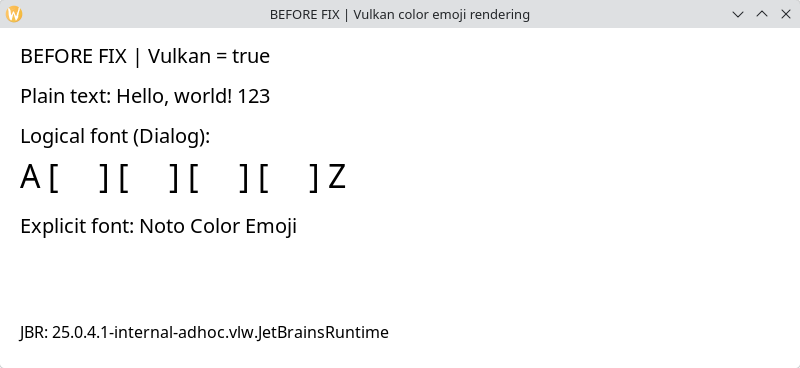
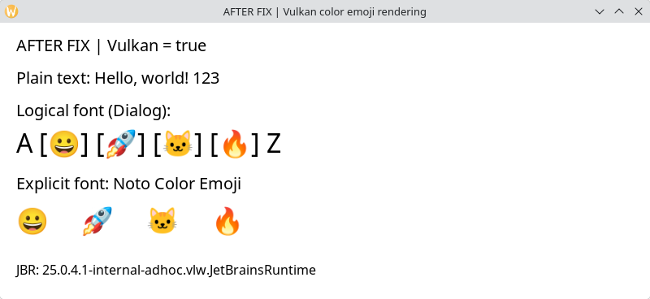

# Invisible color emoji with Vulkan

With WLToolkit and Vulkan enabled, color emoji take up space but do not appear.
Turning Vulkan off brings them back. We reproduced this in the stable IntelliJ
IDEA 2026.2.3 release, GoLand 2026.3 EAP, and a small standalone Swing application.

These screenshots show the standalone test before and after the fix. Both runs
use the same JBR source revision with **WLToolkit and Vulkan enabled**. The only
runtime difference is the patch. Each window draws ordinary text and emoji using
both the logical `Dialog` font and an explicit `Noto Color Emoji` font.

### Before the fix



### After the fix



## What causes it

In `VKRenderer_DrawGlyphList`, glyph positions are advanced before this check:

```c
if (ginfo->format != sun_font_StrikeCache_PIXEL_FORMAT_GREYSCALE)
    continue;
```

FreeType supplies bitmap color emoji as BGRA glyphs, so the renderer skips them.
This patch sends premultiplied BGRA glyphs through the existing Vulkan image
upload and blit path, preserving row stride. Ordinary text still uses the
existing grayscale mask path.

The test uses the bitmap version of **Noto Color Emoji**, with CBDT/CBLC tables
and no COLR table. This is separate from missing COLRv1 font support.

## Try it

Use a Linux Wayland session with that font installed. From the repository root:

```sh
# Compare the software and Vulkan pipelines.
bash examples/vulkan-color-glyphs/run.sh /path/to/jdk false visual
bash examples/vulkan-color-glyphs/run.sh /path/to/jdk true visual

# Run the pixel check and save its output.
bash examples/vulkan-color-glyphs/run.sh /path/to/jdk true pixels snapshot.png
```

The pixel test draws four emoji followed by ordinary text into a `VolatileImage`,
then counts color pixels and text pixels in its snapshot. For a Vulkan run, it
also checks that the graphics configuration is `WLVKGraphicsConfig`.

## Results

All four runs use the same source revision on the same machine:

| Build and pipeline | Color pixels | Text pixels | Result |
| --- | ---: | ---: | --- |
| Unpatched, software | 4575 | 1001 | Pass |
| Unpatched, Vulkan | 0 | 1001 | Fail |
| Patched, software | 4575 | 1001 | Pass |
| Patched, Vulkan | 4575 | 1001 | Pass |

The patched Vulkan image reported hardware acceleration and matched the patched
software snapshot pixel for pixel. Pixel counts depend on the font and test
environment. The raw pixel-test images are also available:
[unpatched Vulkan](before-vulkan.png), [patched Vulkan](after-vulkan.png), and
[software reference](software-reference.png).

## Build

The patch is based on JetBrains Runtime's `jbr25` branch at
`95357d90d8bde24fd0d3788ae33c8871b0b5b8db`.

With the Linux JDK build dependencies and Vulkan shader tools installed:

```sh
bash configure --with-boot-jdk=/path/to/jdk-25 \
  --with-vulkan --with-debug-level=release --with-jvm-variants=server
make images
```

The resulting JDK is in `build/linux-x86_64-server-release/images/jdk`.
The local build used GCC 15.2 and `--disable-warnings-as-errors`, without JCEF.
The patched runtime was tested with the standalone applications; it has not
been tested inside either IDE.

## Remaining work

This fixes the missing glyphs in the reproducer, but it does not add a glyph
texture cache. Performance has not been measured. Transforms, clipping,
compositing, scaling, other color font formats, and other GPUs still need testing.

Related: [JBR-7558: WLToolkit Vulkan rendering pipeline](https://youtrack.jetbrains.com/issue/JBR-7558).
